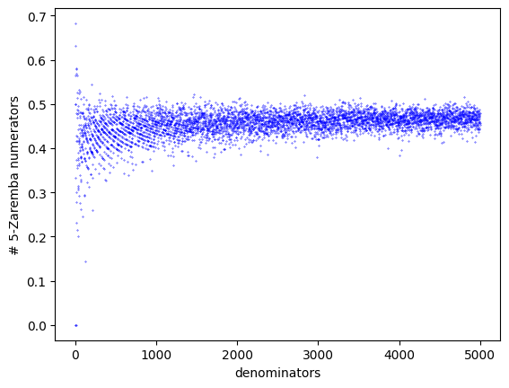

# A (very) short introcution to Continued fractions

We usually use the decimal expansion to represent real numbers, though this is not the only representation method. For example, in most digital programming, we usually eventually use binary expansion (or maybe hexadecimal expansion).

All of these expansions depend on the choice of basis (namely 10, 2, and 16 respectively). However there is nothing special about these choices, and we can do it with any natural number, so in a sense, the digits appearing in these expansions do not give "too much" information.

Another representation method, called the [continued fraction expansion](https://en.wikipedia.org/wiki/Continued_fraction), usually gives much more information about each number, at the cost that the digits can be any natural number (and not just 0,...,9 as in the decimal expansion).
Basically, the expansion looks like:

$$\pi = [3; 7, 15, 1, 292, 1, ...] := 3 + \cfrac{1}{7+\cfrac{1}{15+\cfrac{1}{1+\cfrac{1}{292+\ddots}}}}$$

We can extract a lot of information from such an expansion. For example, stopping after the second digits gives:

$$\pi \sim [3; 7] := 3 + \cfrac{1}{7} = \frac{22}{7} = 3.14285714286...$$

which is a very good approximation for $\pi$ by a rational number with a very small denominator.

These types of approximation appears often in math, general science and engineering, and even in nature. It is used to construct clocks, it is why we have 12 notes in an octave, and why the golden ratio appears everywhere in nature.

---

# Zaremba's conjecture

Hoping that I convinced you that these continued fractions are interesting, there are all sorts of questions about them. One of them related to continued fractions of rational numbers, which are always finite. 

Originally studying discrepencies, and how to generate randomness, Zaremba was led to this continued fraction expansion of rational numbers. He found out that when such numbers have continued fractions where the coefficients are very small (e.g. all bounded by 5), they can be used to generate sequences with very low discrepency.
For more details about this you can watch Alex Kontrovich's great talk [here](https://www.youtube.com/watch?v=1-wenIzupFU&ab_channel=InstituteforAdvancedStudy).

With this in mind, Zaremba conjectured (1971) that there is some bound $C$, such that each denominaor $m$ has some numerator $n$ for which $n/m$ has a continued fraction with coefficients bounded by $C$.

This conjecture is not yet proven, however there are partial results. In particular [Bourgain and Kontrovich](https://arxiv.org/abs/1107.3776) showed that for some $C$, "almost all" denominators have such a numerator, and it was later shown by [ShinnYin Hhuang] (https://arxiv.org/abs/1310.3772), that this $C$ can be chosen to be $C=5$.

---

# The code

The code here contains some simple methods to study this phenomena (which came up in one of the research problems I worked on). You can use it directly using the google colab document [here](https://colab.research.google.com/drive/1TVvUvjRyrIaBGCmS4ss5wV8abFo39PvD#scrollTo=362pOsGrjWEu).

You can for example use it to generate graph as the one below, which counts the number of Zaremba rationals for all denominators up to 5000 with prime numerators:

The $y$ value here is $\frac{\log(\text{numerators count})}{\log(\text{denominator})}$, so the fact that it approaches $\frac{1}{2}$ means that $\text{numerators count} \sim \sqrt{\text{denominator}}$

# Extra:

Just to help, if you need to write LaTeX formulas for continued fractions, and you hate keeping track of all the parentheses, you can use this [google colab notebook](https://colab.research.google.com/drive/1nQy1q_-6ik0ylvbXvW2jRzZkaLhLzMG5#scrollTo=A7Wphrth42aW).